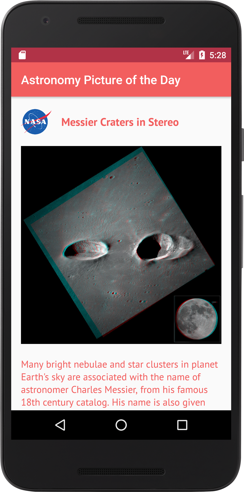

# APOD-Kotlin

## MVP + Network View State Machine

Inspired by the following talk from the KotlinConf 2017:

https://www.youtube.com/watch?v=Vre-Ih5Gdc0

https://resources.jetbrains.com/storage/products/kotlinconf2017/slides/aViewStateMachine.pdf

## Nasa Open API

https://api.nasa.gov/api.html#apod